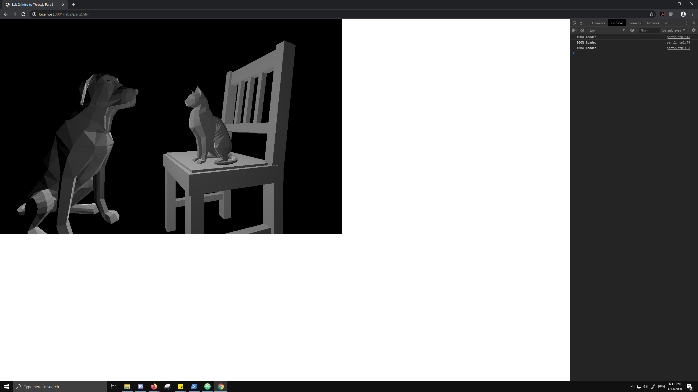

lab2: https://drive.google.com/file/d/1yO6P0SNNJxdmPUDoW1PTSSxgLI1JI7qv/view?usp=sharing

lab3: https://drive.google.com/file/d/1RdRHXOMC5cttd7UUfyJ-HywoeNAkItZN/view?usp=sharing
  Left to Right
  1st: The Three,js function for MeshPhongMaterial includes a specular parameter which you can set the color to. the specular color       was set to a green color.
  2nd: MeshPhongMaterial also allows you to adjust opacity which is set to half and i also changed the object color to green and the specular to light blue.
  3rd: I interpolated the colors blue and pink in the frag shader.
  4th: I passed the 'modelViewPosition' vec4 in the vertex shader into the color frag in the frag shader.
